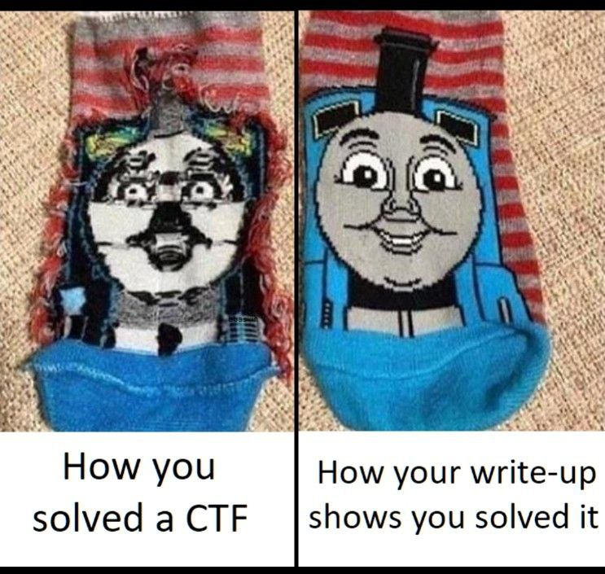
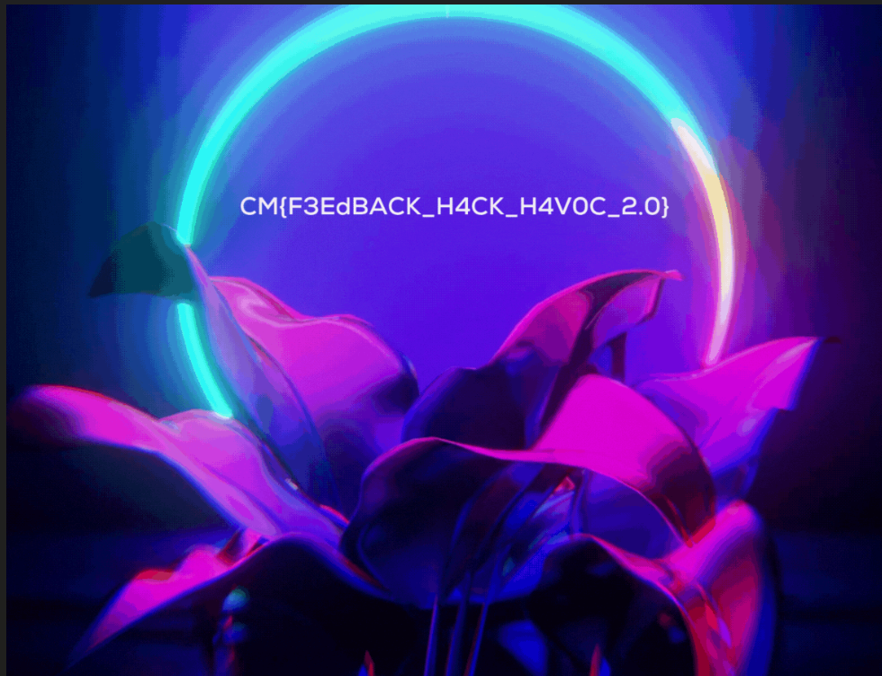
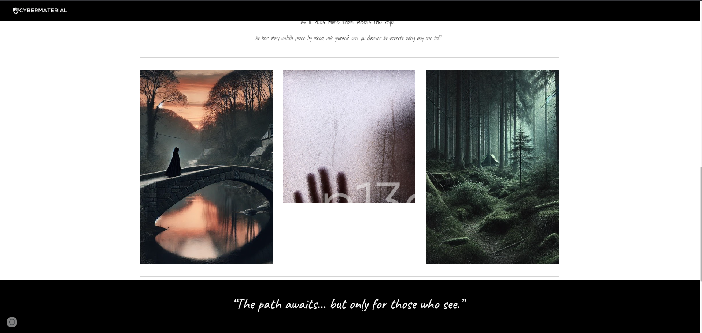
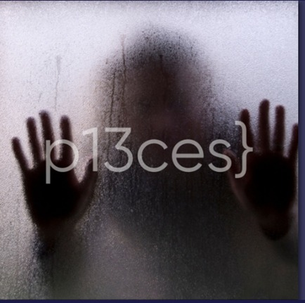
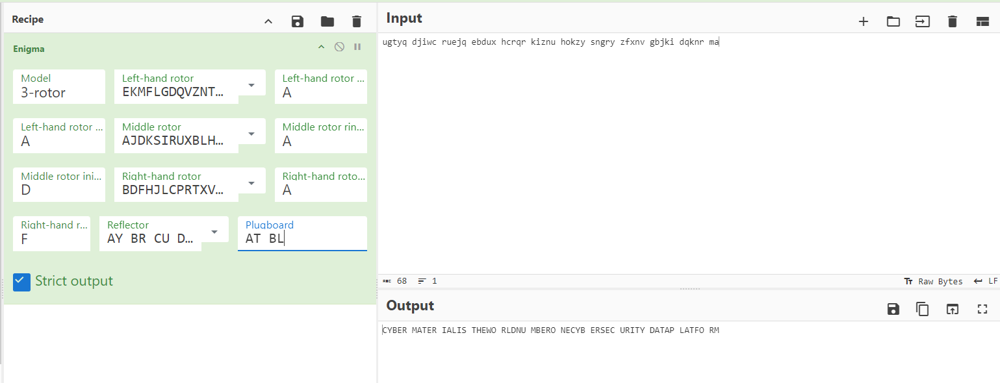
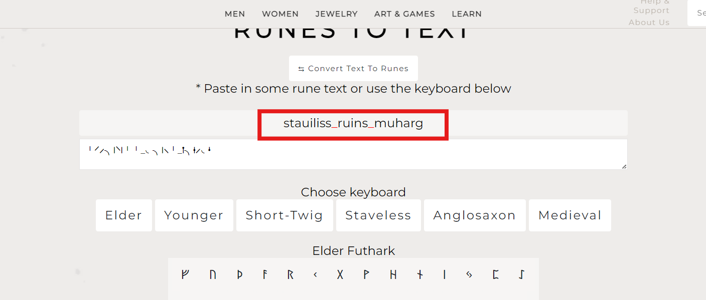

**Welcome to Hack Havoc 2.0 CTF!**  
 Some how i liked  this ctf & Placed in 6TH Position.  
**what Made me intrest ?**
Prizes  
PJPT Certification by TCM  
HackTheBox Gift Voucher (3 Months VIP) + Ebook  
Top 10 Participants: 1-hour Career Consultation with Cybersecurity Leader  
Top 20 Participants: Access to internship opportunities at CyberMaterial and 911Cyber  



--------

Challenge - Bonus  
**Challenge** - **Welcome To CyberMaterial**
> **Welcome to Hack Havoc 2.0. The Premiere CTF Hosted by Cybermaterial.**  
> Before we start the journey, let's make a detour to our Discord Server and Instagram.  
> Friends are crucial for every adventure ...
> 
> [Discord](https://discord.com/invite/ATw3qYMX7e)  
> [Instagram](https://www.instagram.com/cybermaterial_/)  
> [LinkedIn](https://www.linkedin.com/company/cybermaterial/)
> 
> Don't forget to give us a follow
> 
> **Flag Format:** `CM{String}`

At starting i am not able to figure out where to find first part of flag. After exploring discord options, I decided to try Discord bot, and using commands, I totally played with all discord command's i get to know i can execute command & get information so i directly excuted /flag 😁 & we all know where 2nd part of flag is located....... Instagram https://www.instagram.com/cybermaterial_/ 

--------------------

**Challenge** - **Bonus**  
> Want to grab some easy points? Here’s your chance! All you have to do is follow CyberMaterial on LinkedIn and send us a screenshot as proof on Google Form. Once we verify, we’ll add 10 points to your score.📈
> URL : https://www.linkedin.com/company/cybermaterial
>
> Already following us? No problem! Send us a screenshot, and you’ll still get the points. 😊
>
> Plus, if you keep following us, you’ll earn bonus points for our next CTF event. Of course, we’ll verify that you’re still a follower when the time comes!
>
> Good luck! 🔥
>
> https://forms.gle/nF4eTtEJAHepKVdy6
> Just follow there linkedin page, take screenshot & upload it on google form. They automatically added point's who ever filled google form.
>
---
**Challenge** - **FeedBack**
>Flag you will be getting on mail
>
>https://forms.gle/MtgWRp67i7n2QZJ86

Fill there feedback form you will get flag. Bruhh my eye's dead at that time literally 🥲 i got a mail but the thing is that flag is in a picture thb i due to sleepy mood i didn't recognized O & 0 Lost my 3 tries. Contacted Admin after realizing He incresed one attempt 😅 

------------------------------

**Category** - **Mobile**  
**Challenge** - **APK-ocalypse Now!**
> Put on your detective hat and dive into our mysterious APK! Get it and uncover hidden treasures—will it be memes, cat videos, or just code? Get ready to crack the APK-ocalypse!
> **Access File in Challenge-Files/hackhavoc.apk**

Pretty Easy one, Opned my jadx-gui you know when ever we open apk file we will start analyzing code & **.xml** Files But why ? **Extensible Markup Language (XML) define and store data in a shareable manner** . So checked all main .xml files **PZ{U1qq3a_7Y4t_1a_Z4aVS35G}** this is something looked suspesious & we alway's like to decrypt stuff 🤡, Some how i felt it is ROT 13 Started with that i got Flag brooo

**CM{H1dd3n_7L4g_1n_M4nIF35T}**

------------------------------


**Category** - **Stego**
**Challenge** - **Incidents in Disguise**
> Is this an image or a game of Hide and Seek? Between the incidents of May and June, secrets lurk in the pixels! Something reversing makes things easier. Lets Rock!!
> Hint's
>  Incidents in Disguise Reverse You Rock with the latest one  and try with some top you Rock list password contains: amos amos amos 
>  Incidents in Disguise You Rock You Rock You Rock  Now backtrack the file and hint XD.

This challenge i was not able to solve at starting cause don't know the password to do steganography. After Few Hint's i get to know we need to use New Rockyou.txt According to Hint's **amos** is something they stressed so i greped amos from rockyou.txt [rockyou.txt](https://github.com/brannondorsey/naive-hashcat/releases/download/data/rockyou.txt) Many people asked me which rockyou & tool need to use i suggested this one & this worked for me.

```bash
sudo apt-get install steghide -y
cat rockyou.txt | grep "amos" > pass.txt
```
```bash
#!/bin/bash
image="file.jpg"
wordlist="pass.txt"

while read password; do
    echo "Trying password: $password"
    steghide extract -sf "$image" -p "$password" -f > /dev/null 2>&1

    if [ $? -eq 0 ]; then
        echo "[+] Success! Password found: $password"
        exit 0
    fi
done < "$wordlist"

echo "[-] No password found in the wordlist."
```

```bash
./req.sh
```
Finally after running this you will get to know this is password is ***7¡Vamos!**

```bash
steghide  steghide extract -sf file.jpg -p *7¡Vamos!
cat flag.txt
```

<!-- -->

**Challenge** - **p13ces**
> Once upon a time in the land of pixels, a sneaky group of flags decided to hide in the most unexpected places—inside ordinary images! ☠️ Your quest, brave adventurer, is to embark on a > pixelated treasure hunt. Help Lira uncover the hidden pieces, decode the message, and craft the legendary flag.
>
> Flag Formate : CM{}
>
>https://sites.google.com/cybermaterial.com/lira-journey/

Starting i am thinking why this weird website ??? after carefully seeing some text in picture ????? yeah...  
I had seen source page to see other pictures 




[image-1](https://sites.google.com/cybermaterial.com/lira-journey/)  
[image-2](https://sites.google.com/cybermaterial.com/lira-journey/the-woods)  
[image-3](https://sites.google.com/cybermaterial.com/lira-journey/the-woods/the-escape?authuser=0)  

After case fully seeing some text is locked in picture i tried to combined all 3 it shown something like this.  
  
What is **P13ces}** Ofcource it is last 1/4th flag... what about remaining ? I had no clue what to do ....... But each image had a sequence number so i started going steganography with steghide 
They maintained a sequence you don't need any Password to extract image 1, but you need for image 2, but what is password for image 2? what ever part of flag in extracted text in image 1...... loop continues up to 4.

```bash
steghide extract -sf 1.jpg
 cat part-1-flag.txt

steghide extract -sf 2.jpg
cat part-2-flag.txt

steghide extract -sf 3.jpg
cat part-3-flag.txt

steghide extract -sf 4.jpg
cat part-4-flag.txt 
```

```bash
image - 1 ( Lira walked through the quiet village at dusk, her thoughts wandering as she crossed the old bridge.  She noticed something strange about the stone railing—a small, engraved marking. She traced her finger over it and uncovered a hidden message: **{Break_** )

image - 2 ( Deep in the forest, Lira found a strange rock formation. Beneath one of the stones, another engraving appeared: "**1t**". The pieces were falling into place, but the meaning still escaped her )

image - 3 ( As Lira ventured further, she stumbled upon an abandoned cabin. Inside, hidden in the floorboards, was yet another piece of the puzzle:  Visit this site and get your part: https://pastebin.com/V3nbr0sm.**_1int0_** The mystery was growing, and the answers seemed just out of reach.  )

image - 4 (  At last, Lira reached the heart of the forest, where a small clearing lay undisturbed. In the center, a worn parchment was pinned to the ground. Written on it was the a riddle that can contain the final clue: 

"In the realm of shapes, I’m the base of a square
In the world of shapes, I form a perfect square,
A hint lies in balance; I help you explore,
Count me well, and you’ll see I am more.
I'm just a single digit number, all alone."

It dawned on her, she had to put all the pieces together to unlock the final part of the 5 pieces hidden message.

FLAG: CM{xxxxx_#x_#xxx#_#_x##xxx} )

```

<!-- -->


After seeing flag format CM{xxxxx_#x_#xxx#_#_x##xxx} i had connected all pieces P13ces}, {Break_, 1t, _1int0_.  
**CM{Break_1t_1int0_4_p13ces}**


---


**Category** - **OSINT**  
**Challenge** - **Hack Uncovered**
> Think you can find the flag buried in a sea of data? This PDF is packed with juicy details about July's 2024 incidents/alerts, but beware 
> somewhere within lies your prize! Can you navigate the top threats, Vulnerability, and regulations to uncover what’s hidden? and Craft the flag > with the name Put your OSINT skills to the test! 🕵️‍♀️📄              Flag : CM{a_b_c}

I feel my self i sooo good at osint challenges lol 😅 but this osint challenges didn't feel up to the mark.
Please look challenge file in **Challenge-Files/Hack Uncovered.pdf**

They clearly menctioned to search about **top threats**, **Vulnerability**, **regulations** After calefully reviewing

**Top Threats = DarkGate**  
**Vulnerability = CVE-2024-5217**  
**regulations = KOPSA**  
Combining this we get flag  
**CM{DarkGate_CVE-2024-5217_KOPSA}**  


**Challenge** - **CyberMaterial Edition!**
> Hall of Hacks July 2024 Edition delves into the latest cybersecurity triumphs and crises, spotlighting top threat actors from hacktivists to >cybercriminals, alongside major breaches, legal battles, and industry-shaping developments.
> 
> But wait—there’s a hidden flag buried among the chaos!

For this challenge i searched a lottt...... & Finall i got a linkedin post with same descreption but at starting those pictures didn't shown anything. And i read challenge descreption again **But wait—there’s a hidden flag buried among the chaos!** & Then i clearly seen all images again & then i got it  
  


-----


**Category** - **REV**  
**Challenge** - **More Like ‘Enig-me’**

> The Enigma Machine was a complex encryption device used by the German military during World War II. Its intricate design and multiple settings > made it incredibly difficult to crack. In this challenge, you'll take on the role of a codebreaker and attempt to decipher a message encrypted > using a modified Enigma Machine.
>
> Encoded txt : ugtyq djiwc ruejq ebdux hcrqr kiznu hokzy sngry zfxnv gbjki dqknr ma
> 
> Decoded txt: cybermateial is the world number one cybersecurity data platform.
> 
> Your flag follows the format CM{Rotor_x-x-x_Pos_x-x-x_Reflector_x_Plug_x-x_x-x_Ring_x-x-x}. Good luck decoding the mystery!"

>Update:More Like ‘Enig-me’
>Challenge is updated 
>Rotor:
>Hint: "These are the first three rotors historically used by the German military Enigma during WWII."
>Position:
>Hint: "The initial rotor positions are aligned with the start of the alphabet but include two letters beyond the first."
>Reflector:
>Hint: "This reflector was the most commonly used during the war, and it shares its name with the second letter of the alphabet."
>Plugboard:
>Hint: "The plugboard swaps involve pairs of letters commonly found at the start of words like 'Apple' and 'Tree,' and 'Banana' and 'Lemon.'"
>Ring Position:
>Hint: "The rings are set to the beginning of the alphabet, leaving no shifts at all."

For this chall i had used hint's they clearly menctioned where what to use.  
  
**CM{Rotor_I-II-II_Pos_A-D-F_Reflector_B_Plug_A-T_B-L_Ring_A-A-A}**


---------

**Category** - **MISC**  
**Challenge** - **The Case of the Missing Flag**


> Congratulations, detective! You’ve found ABC.dat, the file that’s about as exciting as watching paint dry. But wait! Rumor has it there’s a flag tucked away in there, possibly hiding RQ.
> 
> Can you solve the mystery before your snacks run out? Get cracking, and may the bytes be ever in your favor!

First what is .dat file ???? **a data file that stores information specific to the program that created it** So we can open it in notepad right ??
I got some svg file in that which look's a Qr code. So i converted it to a Png file & then scanned with google len's i don't know why it didn't scanned. And then again i scanned with a qr code Scanner app **CM{F0r3n3ic_1s_34sy}** this flag appeared. 


------------

**Category** - **CRYPTO**  
**Challenge** - **The Curious Case of the Jumbled Symbols**
>Dive into a tangled web of characters! Can you decode {╵⸍⸝╮ᛁ⸌ᛁ╵╵_◟╮ᛁ⸜╵_ᛙ╮ᚽ⸝◟ᛍ} ? Here’s a clue: It’s not what it seems—things aren’t always as clear as they appear. Good luck, puzzle master!
>
>Wrap Flag in CM{}
>

This challenge is as easy as it. I just pased this ( ╵⸍⸝╮ᛁ⸌ᛁ╵╵_◟╮ᛁ⸜╵_ᛙ╮ᚽ⸝◟ᛍ ) on google i get to know it is (rune-translator) 
 [https://valhyr.com/pages/rune-translator]  
  


**Challenge** - **CyberMaterialHavoc**

>We heard you're a great CybermaterialHavoc! 🧙‍♂️ Help us decode this baffling message: 🕵️‍♀️💥
>
>AgTIEe5hQ?T5,W.GDyv^N*eRcDuEoizyHNSTN&b$$4m0o9gWL!S\u+^T;/o5m/9YL@HQlje}

In Hint's they already menctioned this will be a 3 level encryption So i opned (dcode)[https://www.dcode.fr/cipher-identifier]

- In Level one it detected it as Base 92 after decrypting i got this ZL{YfphiGdxdicgo_Yzkqu'i_Cmtg_Qfpdiscxawtiz_Xdxl_Khdxcltu}
- Again i used dcode.fr this time it dected as Vigenere Cipher. But wait what it can be???? The only thing they highlighted  is CybermaterialHavoc
  So i used it & then this decrypted to XN{XbyviNzgvirzo_Dliow'h_Yvhg_Xbyvihvxfirgb_Wzgz_Kozgulin}
- Again i used decode.fr this dected as Atbash Cipher so i used it, this one provided me a flag **CM{CyberMaterial_World's_Best_Cybersecurity_Data_Platform}** another easy challenge 


